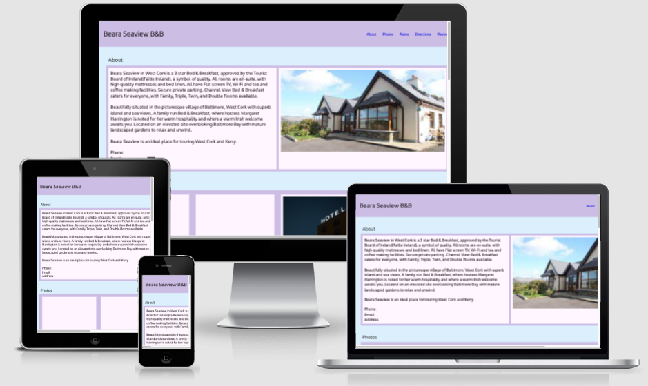
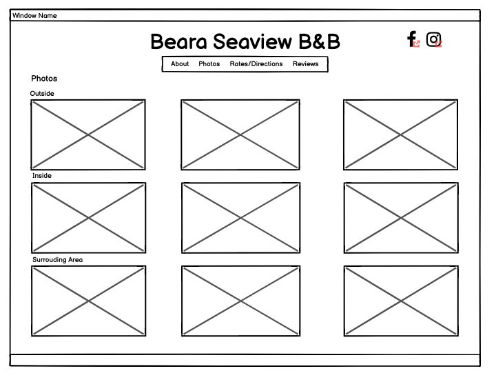
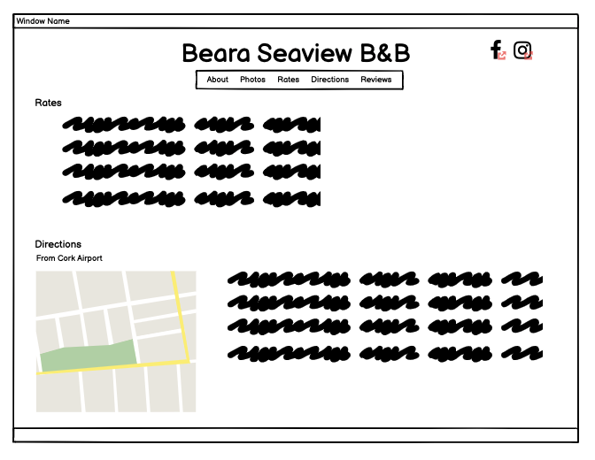
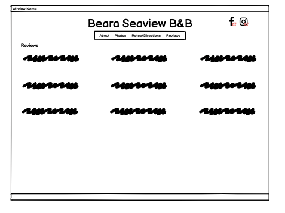
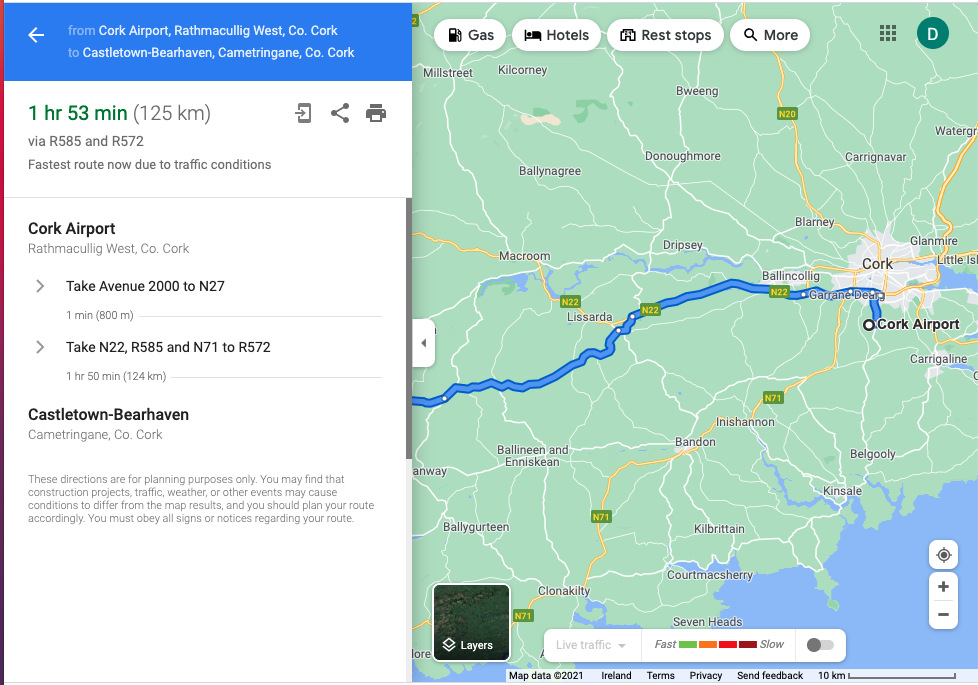

# Beara Seaview Bed & Breakfast

## About Project
The core purpose of this project is to create a website that promotes the featurea and unique offerings of the Beara Searview Bed and Breakfast. The building is currently underconstruction so I've used stock images until real images of the completed renovations are available. 

## UX

### User Stories
                    
Implemented  | User Story
------------- | -------------
Yes  | I need to read general description of B&B, 	so that I can compare to others in the area
Yes  | I want access to contact details, 	so that I can contact b&b with additional requestions
Yes  | I want to see pictures inside and outside B&B, 	so that I can decide I like the layout and decor
Yes  | I want quick access to rates,	so that I know quickly if the B&B fits my budget
Yes  | I want clear driving instructions, 	so that I can get from airport to B&B easily
Yes | I want to read reviews from other visitors, 	so that I can feel a sense of trust 
Yes  | I want access to B&B social media profiles, 	so that I can see interactions from visitors.

### Design
I would have liked to use the Materialize framework as it's really impressive but my skill level is not yet there. It's something I'm looking forward to working towards.

### Color Scheme

* material.io/

I used the tool [material.io](https://material.io/resources/color/#!/?view.left=1&view.right=1&primary.color=D1C4E9&secondary.color=BBDEFB&secondary.text.color=000000&primary.text.color=0a0a0a) to create a primary and secondary color palette.


### Icons

I used [Font Awesome](x) for the website's social media icons. Font Awesome has an incredible collection and make it straight forward to integrate their icons into a project which can then be customised to fit the design and colour scheme. I used these three icons:


### Typography

I used [Google Fonts](https://fonts.google.com/share?selection.family=Oxygen|Ubuntu). Google Fonts website is great to choosing fonts. If you pick one, it will recommend others that pair well with your first font. I've choose Oxygeny and Ubuntu because they are clean and easy to read.


### Wireframes

I used Balsamiq to create wireframes. Wireframing helped me get from the idea stage to coding. This in between step helped me breakdown the website into features. Below are my wireframes.






## Features

### Successfully Implemented Features
* Navigation Bar
>This makes it easy for the visitor to acces various sections of the sight. 


* Smooth scroll effect
>This code enables smooth scrolling instead of jumping to a section. It's a nicer experience. 
```html 
{
  scroll-behavior: smooth;  
}
```
* Clickable Map (which opens in Google Maps)
>The image is clickable and will open in Google maps to give full directions. 




### Features Left to Implement
* Calendar - showing current availabiltiy

## Libraries & Technologies Utilised
* [HTML](https://developer.mozilla.org/en-US/docs/Glossary/HTML5) - used to define the content and structure of website.
* [CSS](https://developer.mozilla.org/en-US/docs/Web/CSS) - used to define the appearance and presentation of the website.
* [Git](https://www.atlassian.com/git) - used for branching, merging, and rewriting repository history.
* [GitHub](https://github.com/) - used a hosting service for Git repositories.
* [Gitpod](https://gitpod.io/) - used as a workspace for Git repositories.
* [CSSgrid](https://developer.mozilla.org/en-US/docs/Web/CSS/CSS_Grid_Layout) - used to create a highly responsive grid that's structure is easily manipulated.
* [Google Fonts](https://fonts.google.com/share?selection.family=Oxygen%7CUbuntu) - Used to select and embed fonts in respository.
* [Material.io](https://material.io/resources/color/#!/?view.left=1&view.right=1&primary.color=D1C4E9&secondary.color=BBDEFB&secondary.text.color=000000&primary.text.color=0a0a0a) - Used to select and create primary and secondary colour paletete.
* [Font Awesome](https://fontawesome.com/) - Used to select and import icons into project.


## Testing
### Validators
### Compatibility
### Known Bugs

## Deployment
### Local Deployment
### Remote Deployment

## Credits and Learning Experience

### Content

### Media

* Pexels - All images are stock images from this site

### Acknowledgements
I'm really grateful for the support I've received from the CI course, CI community and my July-5p cohort. I'd like in particular to thank my mentor Tim as well as the tutors who've helped me through LMS challenages - Igor, Scott, Jo and John. 

